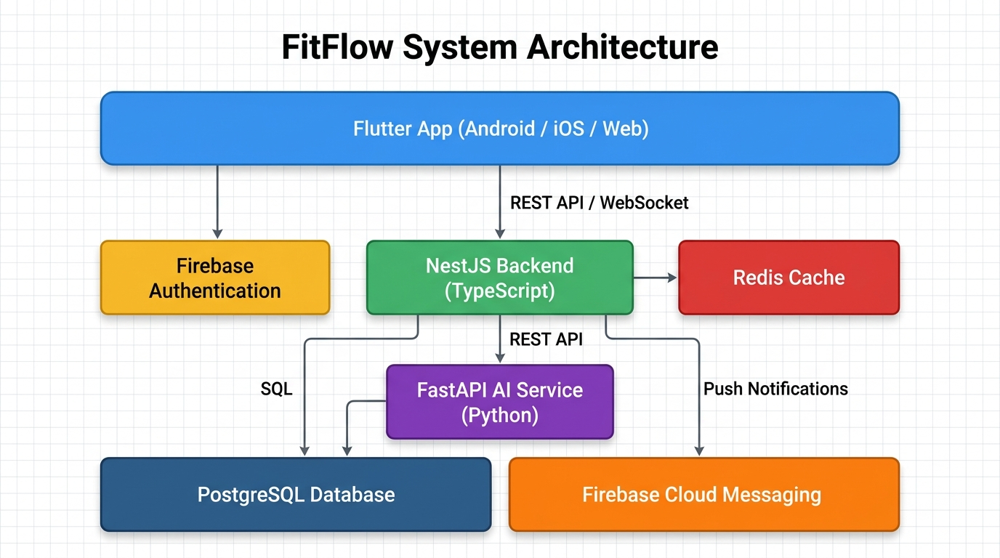

# FitFlow Redesign

A comprehensive redesign of the FitFlow fitness tracking application, developed as part of the IT3060 Human Computer Interaction module (Semester 2, 2026).

## Project Overview

FitFlow is a fitness tracking app that had been experiencing declining user retention and app store ratings. This project follows a structured human-centered design process to redesign the application, addressing key user pain points including limited personalisation, time-consuming meal logging, low motivation and the need for better progress tracking.

The redesign introduces AI-powered personalised workout plans, camera-based nutrition tracking, community challenges and improved progress visualisation.

## Technology Stack

| Layer | Technology | Purpose |
|---|---|---|
| Frontend | Flutter + Dart | Cross-platform mobile and web application |
| Main Backend | NestJS + TypeScript | REST APIs, business logic and real-time features |
| AI Microservice | FastAPI + Python | AI workout recommendations and food image recognition |
| Database | PostgreSQL | Structured relational data storage |
| Authentication | Firebase Authentication | User identity and secure login |
| Caching | Redis | Performance optimisation |
| Push Notifications | Firebase Cloud Messaging | Workout reminders and social notifications |
| Real-Time | WebSockets (NestJS Gateway) | Live community feed and challenge updates |

## Architecture



**Key architecture decisions:**
- Flutter provides a single codebase for Android, iOS and web.
- NestJS handles all core application logic with a structured modular architecture.
- FastAPI runs as a separate microservice for AI/ML features, allowing independent scaling.
- PostgreSQL stores all relational fitness data (users, workouts, progress, meals, challenges).
- Firebase Authentication manages user identity without building authentication from scratch.

For detailed architecture documentation, see the [Architecture Decision Record](docs/adr/ADR-001-technology-stack.md).

## Folder Structure

```
fitflow-redesign/
├── frontend/                  # Flutter application
├── backend/                   # NestJS main backend
├── ai-service/                # FastAPI AI microservice
├── docs/                      # Project documentation
│   ├── tech-stack-summary.md
│   ├── comparison-matrix.md
│   ├── architecture.md
│   └── adr/
│       └── ADR-001-technology-stack.md
├── .gitignore
├── README.md
└── LICENSE
```

## Setup Instructions

### Frontend (Flutter)
```bash
cd frontend
flutter pub get
flutter run
```

### Backend (NestJS)
```bash
cd backend
npm install
npm run start:dev
```

### AI Service (FastAPI)
```bash
cd ai-service
pip install -r requirements.txt
uvicorn main:app --reload
```

## Documentation

- [Technology Stack Summary](docs/tech-stack-summary.md)
- [Comparison Matrix](docs/comparison-matrix.md)
- [Architecture Overview](docs/architecture.md)
- [ADR-001: Technology Stack Selection](docs/adr/ADR-001-technology-stack.md)

## Key Features

- **AI Workout Planner** – Personalised workout plans that adapt to user goals, fitness level and progress.
- **Nutrition Logger** – Camera-based food scanning for quick meal logging.
- **Progress Tracking** – Visual analytics showing workout statistics and goal progress.
- **Community Challenges** – Social features including challenges, leaderboards and community feed.
- **Workout Reminders** – Push notifications to help users stay consistent.

## Research Background

This project is based on user research conducted across Labs 1–4:
- **Lab 1** – Stakeholder identification, research methods and instruments.
- **Lab 2** – Data analysis, personas, user stories, journey maps and requirements.
- **Lab 3** – Interface design, wireframes and low-fidelity prototyping.
- **Lab 4** – Usability testing with 8 participants (SUS score: 75.5/100).
- **Lab 5** – Technology selection, architecture design and repository setup.

## License

This project is licensed under the MIT License. See [LICENSE](LICENSE) for details.
